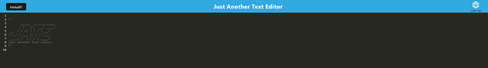

# PWA Text Editor

## Description

This project is a Progressive Web Application (PWA) text editor that allows users to create and edit notes or code snippets, with or without an internet connection. The application provides reliable data persistence using IndexedDB and can be installed as a desktop application.

## Table of Contents

- [Installation](#installation)
- [Usage](#usage)
- [Features](#features)
- [Technologies Used](#technologies-used)
- [Screen Shots](#screen-shots)
- [Contributing](#contributing)
- [License](#license)
- [Questions](#questions)

## Installation

To install and run this application locally, follow these steps:

1. Clone the repository to your local machine.
2. Navigate to the project directory in your terminal.
3. Run `npm install` to install all dependencies.
4. Run `npm run start` to start the development server.
5. Open your browser and visit `http://localhost:3000` to use the application.

To install the application as a desktop app:

1. Visit the application in your web browser.
2. Click on the "Install" button in the address bar or the application's interface.
3. Follow the prompts to complete the installation.

## Usage

1. Open the text editor in your browser or the installed desktop application.
2. Start typing or pasting your content into the editor.
3. Your content will be automatically saved to IndexedDB as you type.
4. You can close and reopen the application, and your content will be retrieved from the database.
5. You can use the online deployed version to test the application [J.A.T.E](https://pwatexteditor-cvq9.onrender.com/)

## Features

- Create and edit text content or code snippets
- Automatic saving to IndexedDB
- Offline functionality
- Installable as a desktop application
- Syntax highlighting (if implemented)

## Technologies Used

- HTML/CSS/JavaScript
- IndexedDB for client-side storage
- Webpack for bundling JavaScript files
- Workbox for service worker and PWA functionality
- Babel for backwards compatibility
- Node.js and Express.js for the server

## Screen Shots

## Contributing

Contributions to this project are welcome. Please follow these steps:

1. Fork the repository
2. Create a new branch (`git checkout -b feature/AmazingFeature`)
3. Commit your changes (`git commit -m 'Add some AmazingFeature'`)
4. Push to the branch (`git push origin feature/AmazingFeature`)
5. Open a Pull Request

## License

This project is licensed under the MIT License. See the [LICENSE](LICENSE) file for details.

## Questions

For any additional questions or concerns, please contact the
[zainabid333](https://github.com/zainabid333/TechBlog)
